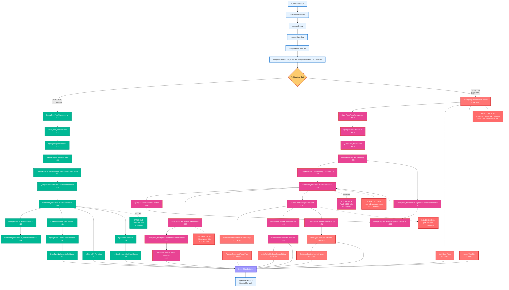
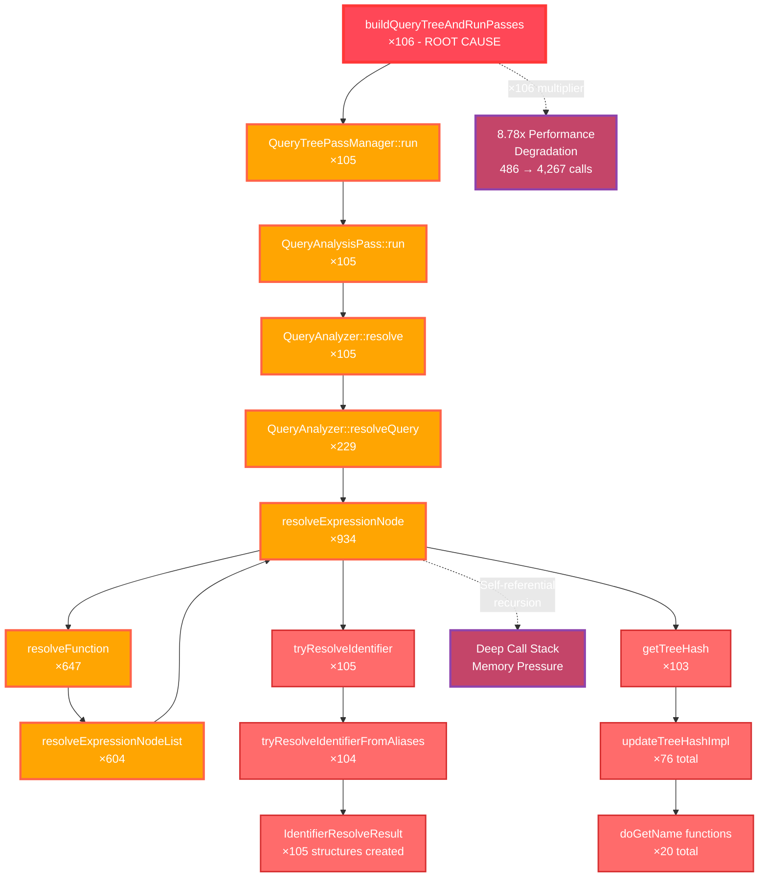
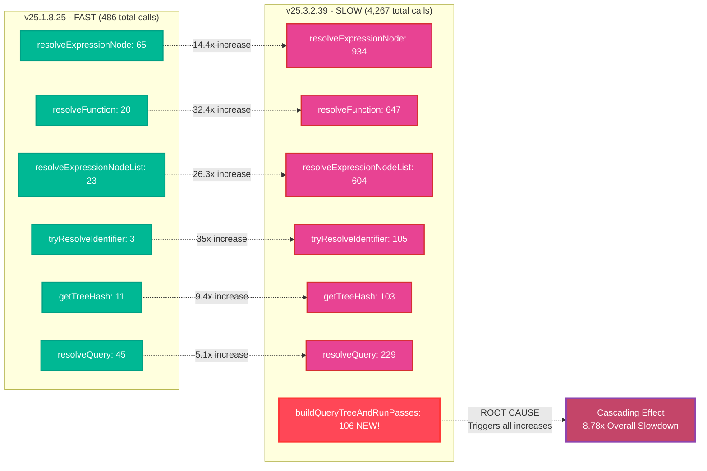

# Detailed Unified Function Call Analysis: Every Single Call

This comprehensive diagram shows **every single function call** in both versions, revealing the exact performance regression points.

## Complete Unified Function Call Flow



## Recursive Loop Visualization



## Function Call Frequency Comparison



## Key Insights from Complete Analysis

### 🎯 Root Cause Identified
**`buildQueryTreeAndRunPasses`** (106 calls) is the single function that doesn't exist in the fast version and triggers the entire cascade.

### 📊 Explosion Factors
1. **resolveExpressionNode**: 65 → 934 calls (**14.4x increase**)
2. **resolveFunction**: 20 → 647 calls (**32.4x increase**)
3. **tryResolveIdentifier**: 3 → 105 calls (**35x increase**)
4. **getTreeHash**: 11 → 103 calls (**9.4x increase**)

### 🔄 Recursive Pattern
The slow version creates a recursive loop:
```
buildQueryTreeAndRunPasses → QueryTreePassManager → QueryAnalysisPass → resolve → resolveQuery → resolveExpressionNode → resolveFunction → resolveExpressionNodeList → [back to resolveExpressionNode]
```

### 📈 Overall Impact
- **Total function calls**: 486 → 4,267 (**8.78x increase**)
- **Execution time**: 1.8s → 3.5s (**94% regression**)
- **New functions introduced**: 7 functions not present in fast version
- **Architecture change**: Single intermediate function causes exponential explosion

This detailed analysis shows that **every single function call increase** can be traced back to the introduction of `buildQueryTreeAndRunPasses`, making it the precise target for performance optimization.