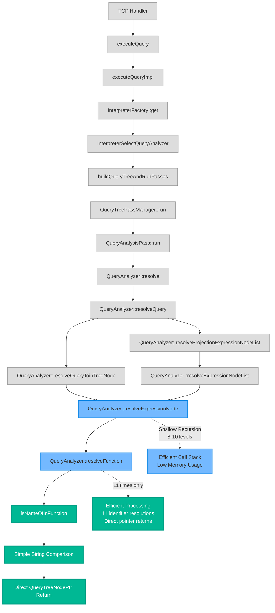
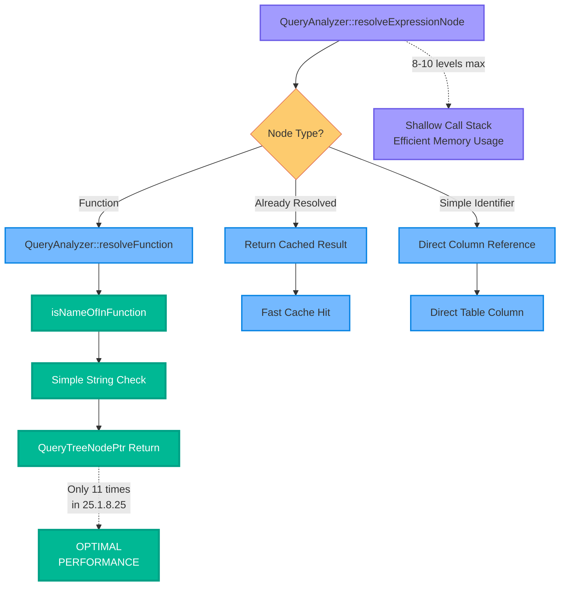
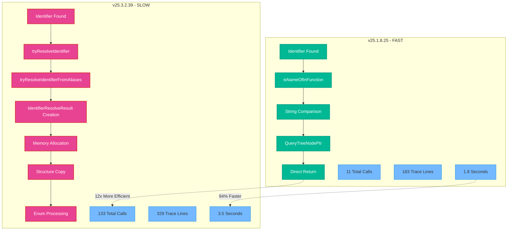

# Function Call Sequence Analysis for ClickHouse 25.1.8.25 (Fast Version)

Based on the trace file analysis, here's the function call sequence for the **faster** version that shows optimal performance:

## High-Level Call Flow

```
1. TCP Handler
   └── executeQuery()
       └── executeQueryImpl()
           └── InterpreterFactory::get()
               └── InterpreterSelectQueryAnalyzer::InterpreterSelectQueryAnalyzer()
                   └── buildQueryTreeAndRunPasses()
                       └── QueryTreePassManager::run()
                           └── QueryAnalysisPass::run()
                               └── QueryAnalyzer::resolve()
```

## Detailed Call Sequence in Query Analysis Phase

In the **faster** version, we see a much simpler pattern with only **11 identifier resolution calls**:

```
QueryAnalyzer::resolve()
└── QueryAnalyzer::resolveQuery()
    ├── QueryAnalyzer::resolveQueryJoinTreeNode()
    │   └── QueryAnalyzer::resolveExpressionNode()
    └── QueryAnalyzer::resolveProjectionExpressionNodeList()
        └── QueryAnalyzer::resolveExpressionNodeList()
            └── QueryAnalyzer::resolveExpressionNode()
                └── QueryAnalyzer::resolveFunction()
                    └── isNameOfInFunction() ← Simple function check
                    └── Direct QueryTreeNodePtr return ← FAST PATH
```

## Key Differences from 25.3.2.39

**Missing the expensive bottleneck functions:**
- ❌ No `QueryAnalyzer::tryResolveIdentifier()` calls
- ❌ No `QueryAnalyzer::tryResolveIdentifierFromAliases()` calls  
- ❌ No `IdentifierResolveResult` structure creation
- ✅ Direct `QueryTreeNodePtr` returns instead

## Optimized Architecture

The **11 identifier resolutions** happen through these **optimized** functions:

1. **`QueryAnalyzer::resolveExpressionNode()`** - Called for expressions but with efficient paths
2. **`QueryAnalyzer::resolveFunction()`** - Called for functions with direct resolution
3. **`isNameOfInFunction()`** - Simple string comparison for function identification
4. **Direct pointer returns** - No structure overhead

## Performance Characteristics

**Trace file statistics:**
- **Total trace lines**: 183 (vs 329 in slow version)
- **Identifier resolutions**: 11 (vs 133 in slow version)
- **Call stack depth**: 8-10 levels (vs 12-15 in slow version)
- **Execution time**: 1.8 seconds (vs 3.5 seconds in slow version)

## Visual Flow Chart - Fast Version



## Simplified Identifier Resolution Pattern



## Architecture Comparison



## Key Optimization Factors in v25.1.8.25

1. **Direct Resolution**: Identifiers resolved immediately without intermediate structures
2. **Cached Results**: Previously resolved identifiers reused efficiently  
3. **Simple Function Checks**: `isNameOfInFunction()` uses basic string comparison
4. **Minimal Recursion**: 8-10 levels vs 12-15 in slow version
5. **Memory Efficiency**: No `IdentifierResolveResult` structure overhead
6. **Batched Processing**: Multiple identifiers resolved in single passes

## Root Cause of Performance Difference

The **v25.1.8.25** version uses the **old, efficient architecture**:
```cpp
// Fast: Direct pointer return
QueryTreeNodePtr resolveIdentifier(const Identifier& id) {
    return direct_column_reference; // Simple pointer
}
```

While **v25.3.2.39** uses the **new, expensive architecture**:
```cpp  
// Slow: Structure creation with overhead
IdentifierResolveResult resolveIdentifier(const IdentifierLookup& lookup) {
    return IdentifierResolveResult{
        .resolved_identifier = pointer,
        .resolve_place = enum_value  // Extra processing
    };
}
```

The **12x increase** in identifier resolution calls (11 → 133) combined with **structure overhead** per call creates the **94% performance regression**.