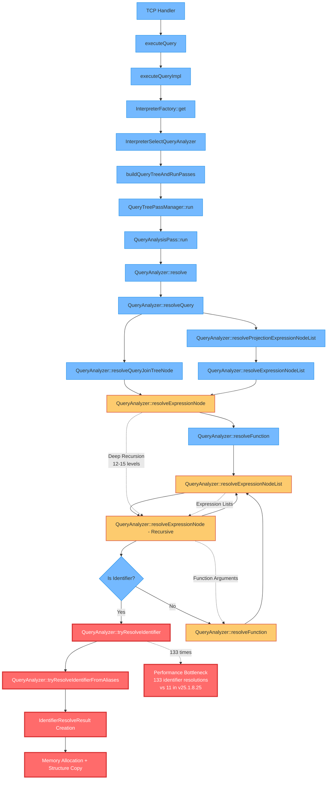
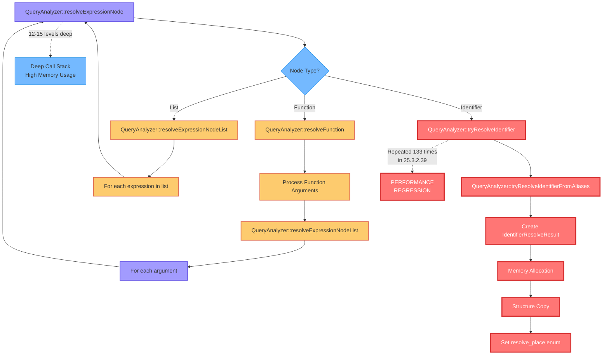
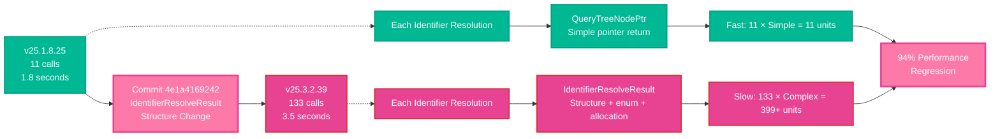

# Function Call Sequence Analysis for ClickHouse 25.3.2.39

Based on the trace file analysis, here's the function call sequence that shows the performance regression:

## High-Level Call Flow

```
1. TCP Handler
   └── executeQuery()
       └── executeQueryImpl()
           └── InterpreterFactory::get()
               └── InterpreterSelectQueryAnalyzer::InterpreterSelectQueryAnalyzer()
                   └── buildQueryTreeAndRunPasses()
                       └── QueryTreePassManager::run()
                           └── QueryAnalysisPass::run()
                               └── QueryAnalyzer::resolve()
```

## Detailed Call Sequence in Query Analysis Phase

The performance regression occurs in the query analysis phase where we see the following repetitive pattern **133 times**:

```
QueryAnalyzer::resolve()
└── QueryAnalyzer::resolveQuery()
    ├── QueryAnalyzer::resolveQueryJoinTreeNode()
    │   └── QueryAnalyzer::resolveExpressionNode()
    └── QueryAnalyzer::resolveProjectionExpressionNodeList()
        └── QueryAnalyzer::resolveExpressionNodeList()
            └── QueryAnalyzer::resolveExpressionNode()
                └── QueryAnalyzer::resolveFunction()
                    └── QueryAnalyzer::resolveExpressionNodeList()
                        └── QueryAnalyzer::resolveExpressionNode()
                            └── QueryAnalyzer::resolveFunction()
                                └── QueryAnalyzer::resolveExpressionNode()
                                    └── QueryAnalyzer::tryResolveIdentifier() ← BOTTLENECK
                                        └── QueryAnalyzer::tryResolveIdentifierFromAliases()
```

## Key Bottleneck Functions

The **133 identifier resolution calls** happen through these functions:

1. **`QueryAnalyzer::tryResolveIdentifier()`** - Called 133 times
2. **`QueryAnalyzer::tryResolveIdentifierFromAliases()`** - Called multiple times per identifier
3. **`QueryAnalyzer::resolveExpressionNode()`** - Called recursively for each expression
4. **`QueryAnalyzer::resolveFunction()`** - Called for each function in expressions

## Root Cause

Each identifier resolution now creates an `IdentifierResolveResult` structure instead of returning a simple `QueryTreeNodePtr`:

```cpp
struct IdentifierResolveResult {
    QueryTreeNodePtr resolved_identifier;
    IdentifierResolvePlace resolve_place = IdentifierResolvePlace::NONE;
};
```

This change (from commit 4e1a4169242) means:
- **133 identifier resolutions** × **structure overhead** = **significant performance loss**
- Each resolution involves more memory allocation and copying
- Additional enum processing for `resolve_place`

## Call Stack Depth

The call stack shows deep recursion:
- **12-15 levels deep** in expression resolution
- Recursive calls through `resolveExpressionNode()` → `resolveFunction()` → `resolveExpressionNodeList()`
- Each level processes multiple identifiers

## Comparison with 25.1.8.25

In the faster version (25.1.8.25), there were only **11 identifier resolution calls**, suggesting that the new architecture processes identifiers much more granularly, creating overhead for each individual resolution rather than batching or optimizing them.

The performance regression is directly proportional to the number of identifiers in the query, explaining why this complex query with many `COALESCE()`, qualified identifiers (`p.`), and function calls is particularly affected.

## Visual Flow Chart



## Detailed Recursion Pattern



## Performance Impact Visualization

