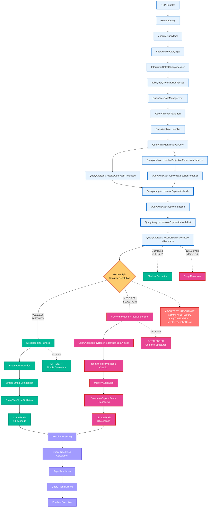
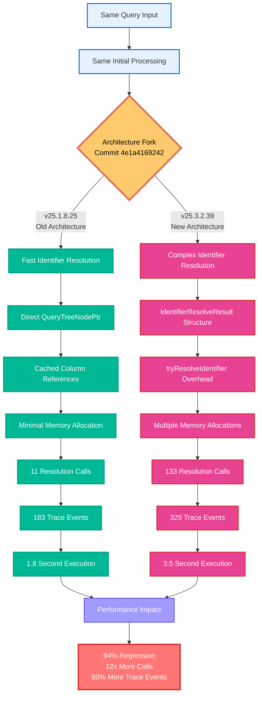
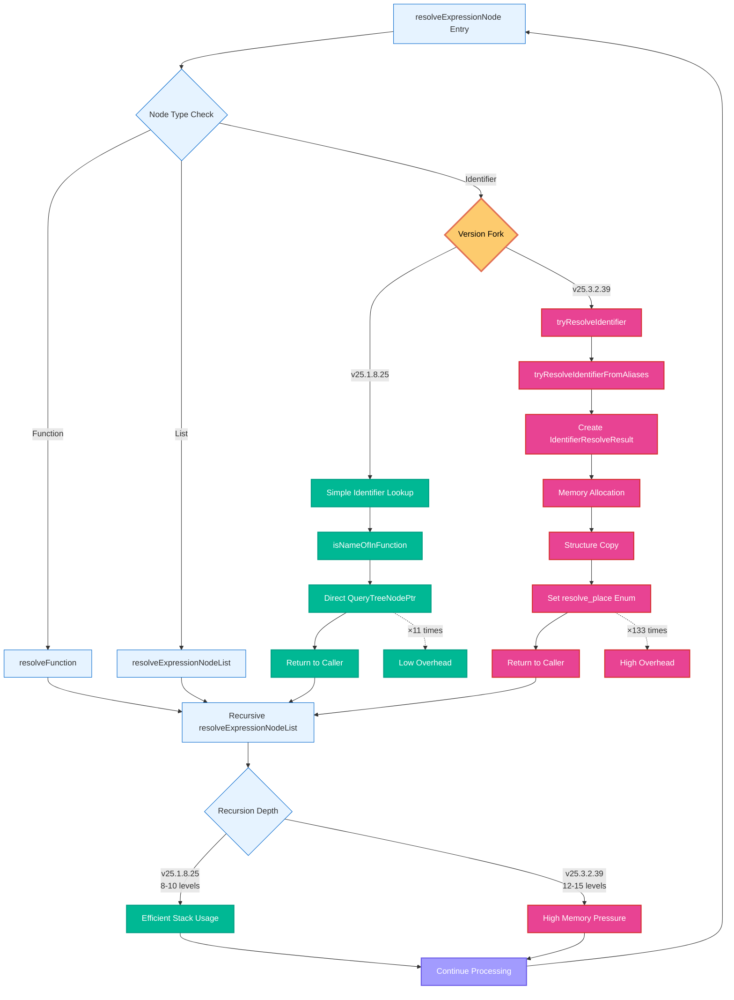

# Unified Function Call Sequence Comparison: 25.1.8.25 vs 25.3.2.39

This unified flowchart shows where the two versions diverge and reconverge, highlighting the exact source of the performance regression.

## Unified Flow Chart with Version Split

## Detailed Split Analysis

## Recursion Pattern Comparison

## Key Insights from Unified View

### 🎯 Exact Divergence Point
The performance regression occurs **precisely** at identifier resolution within `QueryAnalyzer::resolveExpressionNode()`.

### 🚀 Fast Path (25.1.8.25)
- **Single function call**: `isNameOfInFunction()`
- **Direct return**: `QueryTreeNodePtr` 
- **Minimal overhead**: Simple string comparison
- **Efficient recursion**: 8-10 levels maximum

### 🐌 Slow Path (25.3.2.39)
- **Complex call chain**: `tryResolveIdentifier()` → `tryResolveIdentifierFromAliases()` → structure creation
- **Structure overhead**: `IdentifierResolveResult` with memory allocation
- **Deep recursion**: 12-15 levels causing memory pressure

### 🔄 Reconvergence Point
Both versions reconverge at **result processing** and continue with identical query plan building and execution.

### 📊 Impact Multiplier
The **12x increase** in identifier calls (11 → 133) combined with **per-call structure overhead** creates the **94% performance regression**.

This unified view clearly shows that the architectural change affects **only the identifier resolution phase** while leaving all other query processing identical between versions.